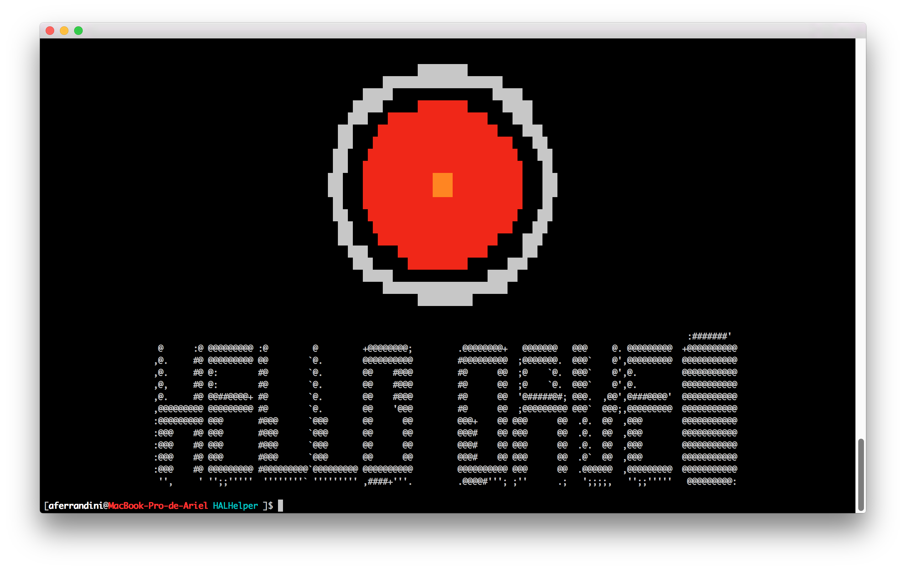
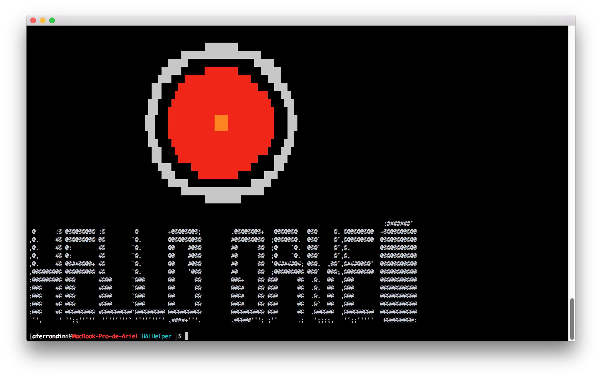
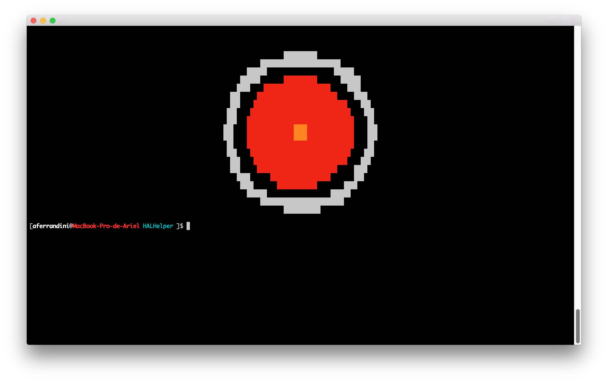
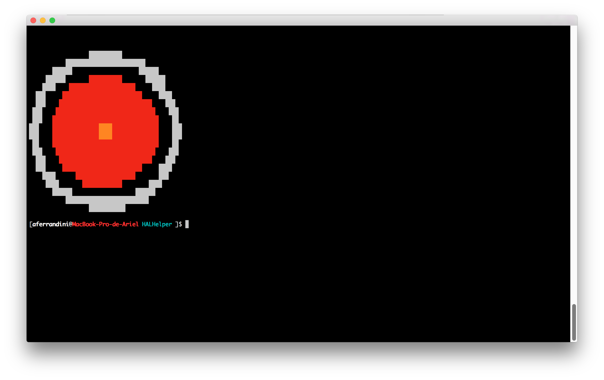

HAL Helper
==========

[](http://travis-ci.org/PHPGames/HALHelper)
[](https://packagist.org/packages/phpgames/hal-helper)
[](https://insight.sensiolabs.com/projects/4b4277a8-33c4-41f3-a354-825b76b1301a)

## Installation

### Step 1: Composer

Add the following line to the `composer.json` file:

``` json
{
    "require": {
        "phpgames/hal-helper": "~1.0"
    }
}
```

## Usage
By default, HAL logo will be shown centered on the screen and without text. To customice the output style
please change the constructor parameters:

### Logo and text align center

```php
$hal = new HAL($output);
$hal->sayHello();
```


### Logo and text align left

```php
$hal = new HAL($output, true, false);
$hal->sayHello();
```


### Only logo align center

```php
$hal = new HAL($output, false);
$hal->sayHello();
```


### Only logo align left

```php
$hal = new HAL($output, false, false);
$hal->sayHello();
```


## License
Released under the MIT License attached with this code.
